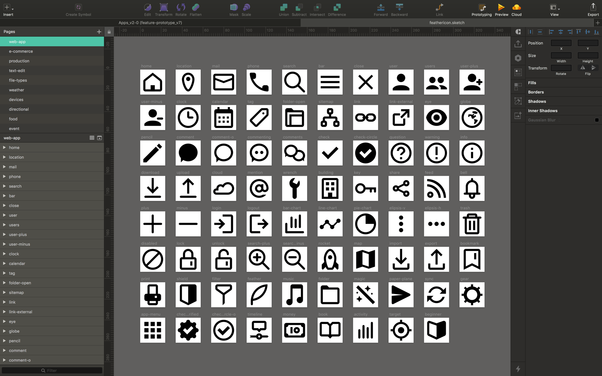

<h1 align="center">feathericon</h1>
<p align="center">feathericon is simple, scalable vector icon font for websites, apps.</p>
<div align="center">
  <a href="https://travis-ci.org/featherplain/feathericon">
    
  </a>
  <a href="https://npmjs.org/packages/feathericon">
    
  </a>
  <a href="https://npmjd.org/packages/feathericon">
    
  </a>
</div>
<p align="center">Website: <a href="http://feathericon.com">http://feathericon.com</a></p>

## Getting Started
1. Download **[ZIP folder from here](https://github.com/featherplain/feathericon/archive/master.zip)**.
1. Copy the entire `build/` directory to your project.
1. In the `<head>` of your html, reference the location to your `feathericon.min.css`.

  ```html
  <link rel="stylesheet" href="path/to/build/css/feathericon.min.css">
  ```
1. Place feathicon with `<i>` tag in your html like this. `fe` class is required to use our icons correctly. Check out [our website](http://feathericon.com) to start using icons!

  ```html
  <i class="fe fe-heart"></i>
  ```

### For developers
1. Install via [npm](https://npmjs.org).

  ```bash
  $ npm install feathericon --save
  ```
1. You can simply point your Sass (SCSS) `include-path` at your `node_modules/` directory. This case is using [gulp-sass](https://www.npmjs.com/package/gulp-sass).

  ```javascript
  gulp.task('sass', function () {
    return gulp.src('path/to/*.scss')
      .pipe(.sass({
        loadPath     : 'node_modules',
        outputStyle  : 'compressed'
      }).on('error', $.sass.logError))
      .pipe(gulp.dest('path/to/css/'));
  });
  ```
  Then you can import it in your scss(sass) file.

  ```scss
  @import "feathericon/build/scss/feathericon";
  ```

## Customize feathericon
### 1. Edit Sketch document



Open the Sketch document in `src/feathericons.sketch`. Each icon exists as an artboard within the Sketch document. If you’re adding an icon, duplicate one of the artboards and add your shapes to it. **Be sure to give your artboard a name that makes sense**.

### 2. Build icons
#### Requires
- Node.js
- npm

You can download from the [Node.js download page](https://nodejs.org/en/download/), or [install via package managers](https://nodejs.org/en/download/package-manager/).
Node.js comes with npm ([See more](https://docs.npmjs.com/getting-started/installing-node)).

1. Open the `feathericon/` directory in Terminal.
1. Run this command to install dependencies for building icons.

  ```bash
  $ npm run setup
  ```
1. Run this command. Running the gulp task will generate the font, css, scss and SVGs, placing them in the `build/` directory.

  ```bash
  $ npm run webfont
  ```

## FontCustom
If you want to tweak font settings, edit `fontcustom.yml`. feathericon is using [FontCustom](https://github.com/FontCustom/fontcustom) to build fonts, stylesheets such as `feathericon.css` and `_feathericon.scss`. If you need more information for FontCustom, visit their GitHub Repository.


## Bugs, Ideas, Pull Requests
If you have any ideas or find bugs, please send me Pull Requests or let me know with GitHub Issues :)

## License
[MIT](https://github.com/featherplain/feathericon/blob/master/LICENSE) (C) 2016 Megumi Hano
